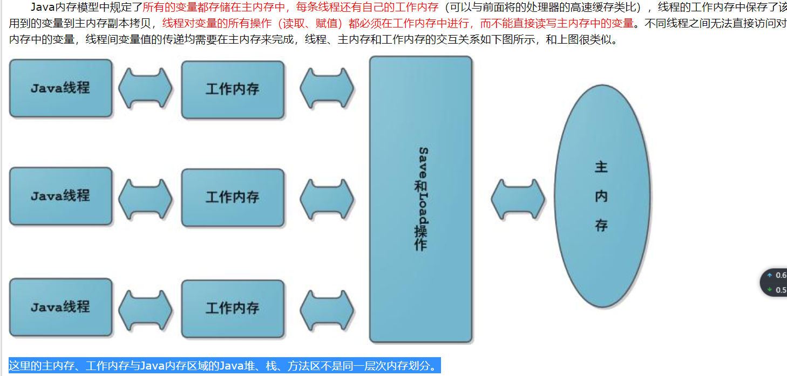

# java 多线程

## 实现多线程的几种方式

- 继承Thread 类，重写run方法

- 实现 Runnable接口，重写run方法。

- 实现 Callable接口，重写call方法。

- 使用线程池

  ```java
  /**
   * 线程实现的三种方式
   */
  public class C1 {
  
      public static void main(String[] args) {
  
          Task myTask = new Task();
  
          new Thread(myTask).start();
  
  
          Task1 myTask1 = new Task1();
          new Thread(myTask1).start();
  
          Task2<Object> myTask2 = new Task2();
          FutureTask<Object> futureTask = new FutureTask<Object>(myTask2);
          new Thread(futureTask).start();
          try{
              System.out.println(futureTask.get());
          }catch(Exception e){
              e.printStackTrace();
          }
          //通过线程池创建
          ExecutorService executorService = Executors.newFixedThreadPool(4);
          executorService.submit(myTask1);
          executorService.execute(myTask);
          executorService.shutdown();
  
  
      }
  
  
      static  class Task extends   Thread{
          @Override
          public void run() {
              System.out.println("Thread当前线程："+ Thread.currentThread().getName());
  
          }
      }
  
      static  class Task1 implements  Runnable{
          public void run() {
              System.out.println("Runnable当前线程："+ Thread.currentThread().getName());
  
          }
      }
  
      static  class Task2<Object>  implements Callable<Object> {
          public Object call() throws Exception {
              System.out.println("实现Callable接口通过FutureTask包装器 当前线程："+ Thread.currentThread().getName());
              return null;
          }
      }
  }
  
  ```

  ## synchronized

   * synchronized关键字，是对**某个对象**加锁
   * 一个同步方法可以调用另外一个同步方法，一个线程已经拥有某个对象的锁，再次申请的时候仍然会得到该对象的锁.也就是说synchronized获得的锁是**可重入**的。**子类调用父类**方法也是可重入的。
   * 程序在执行过程中，如果出现**异常**，默认情况锁会被**释放**
   * wait和notify/notifyAll。

```java
	private Object o = new Object();
	//示例1
	public void m() {
		synchronized(o) { //任何线程要执行下面的代码，必须先拿到o的锁
			count--;
		}
	}
	//示例2
	public synchronized void m() { //等同于在方法的代码执行时要synchronized(this)
        count--;
    }
	//示例3
    public synchronized static void m() { //这里等同于synchronized(yxxy.c_004.T.class)
		count--;
	}
```

## volatile

- volatile 关键字，使一个变量在多个线程间可见。使用volatile，将会强制所有线程都去堆内存中读取running的值。
 - A B线程都用到一个变量，java默认是A线程中保留一份copy，这样如果B线程修改了该变量，则A线程未必知道使用volatile关键字，会让所有线程都会读到变量的修改值
- volatile并不能保证多个线程共同修改running变量时所带来的不一致问题，也就是说volatile不能替代synchronized。volatile只能保证可见性



## ReentrantLock

- reentrantlock可用于替代synchronized，reentrantlock更灵活
- 需要注意的是，必须要必须要必须要**手动释放锁**（重要的事情说三遍），使用syn锁定的话如果遇到异常，jvm会自动释放锁，但是lock必须手动释放锁，因此经常在finally中进行锁的释放
- 使用reentrantlock可以进行“尝试锁定”**tryLock**，这样无法锁定，或者在指定时间内无法锁定，线程可以决定是否继续等待
- 使用ReentrantLock还可以调用**lockInterruptibly**方法，可以对线程interrupt方法做出响应，在一个线程等待锁的过程中，可以被打断。
- ReentrantLock还可以指定为**公平锁**

```
//Lock使用
Lock lock = new ReentrantLock();
lock.lock()//锁定
lock.unlock();//解锁
//Lock Condition 指定某些线程醒来，比notifyAll跟灵活
public T get() {
		T t = null;
		try {
			lock.lock();
			while(lists.size() == 0) {
				consumer.await();
			}
			t = lists.removeFirst();
			count --;
			producer.signalAll(); //通知生产者进行生产
		} catch (InterruptedException e) {
			e.printStackTrace();
		} finally {
			lock.unlock();
		}
		return t;
	}
```

## 同步容器类

同步容器类

1：Vector Hashtable ：早期使用synchronized实现 
2：ArrayList HashSet ：未考虑多线程安全（未实现同步）
3：HashSet vs Hashtable StringBuilder vs StringBuffer
4：Collections.synchronized***工厂方法使用的也是synchronized

使用早期的同步容器以及Collections.synchronized***方法的不足之处，请阅读：
http://blog.csdn.net/itm_hadf/article/details/7506529

使用新的并发容器
http://xuganggogo.iteye.com/blog/321630

## 并发容器

总结：
1：对于map/set的选择使用
- HashMap
- TreeMap
- LinkedHashMap

线程安全

- Hashtable
- Collections.sychronizedXXX
- ConcurrentHashMap
- ConcurrentSkipListMap 

2：队列

- ArrayList
- LinkedList
- Collections.synchronizedXXX
- CopyOnWriteList
- Queue
  - CocurrentLinkedQueue //concurrentArrayQueue
  - BlockingQueue
    - LinkedBQ
    - ArrayBQ
    - TransferQueue
    - SynchronusQueue
    - DelayQueue执行定时任务

## 线程池

- Executor 
- ExecutorService submit
- Callable = Runnable
- Executors 
- ThreadPool
- Future

线程池类型

- fixed 
- cached 
- single 
- scheduled 
- workstealing 
- forkjoin
- 自定义线程池（ThreadpoolExecutor）

## 其他

- AtomXXX类本身方法都是原子性的，但不能保证多个方法连续调用是原子性的

- 采用细粒度的锁，可以使线程争用时间变短，从而提高效率

- 锁定某对象o，如果o的属性发生改变，不影响锁的使用。但是如果o变成另外一个对象，则锁定的对象发生改变。不要以字符串常量作为锁定对象。

- **ThreadLocal**线程局部变量

- 使用Latch（门闩）替代wait notify来进行通知。好处是通信方式简单，同时也可以指定等待时间。CountDownLatch不涉及锁定，当count的值为零时当前线程继续运行。

- 单例模式 线程安全，懒加载，使用匿名内部类实现

  ```java
  public class Singleton {
  	
  	private Singleton() {
  		System.out.println("single");
  	}
  	
  	private static class Inner {
  		private static Singleton s = new Singleton();
  	}
  	
  	public static Singleton getSingle() {
  		return Inner.s;
  	}
  	
  }
  ```

  

##  问题

1. 写两个线程，线程1添加10个元素到容器中，线程2实现监控元素的个数，当个数到5个时，线程2给出提示并结束
2. 写一个固定容量同步容器，拥有put和get方法，以及getCount方法，能够支持2个生产者线程以及10个消费者线程的阻塞调用。
3. 有N张火车票，每张票都有一个编号,同时有10个窗口对外售票.
4. 