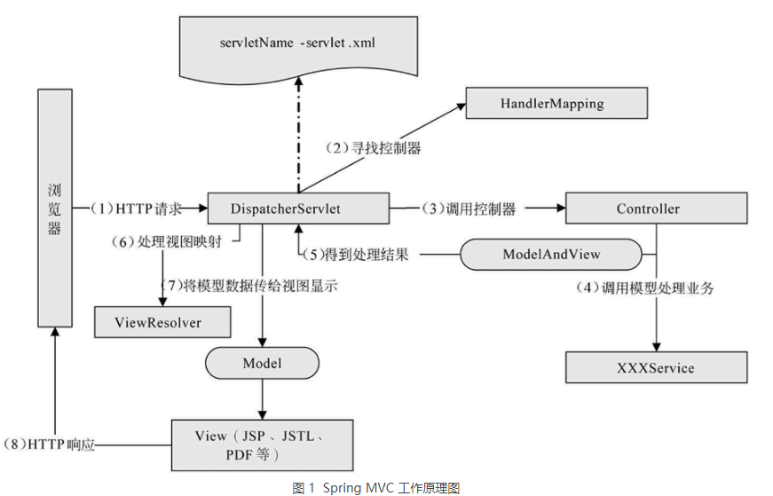

# SpringMVC

## 介绍：

MVC 是 Model、View 和 Controller 的缩写，分别代表 Web 应用程序中的 3 种职责。根本原因在于**解耦**各个模块。

- **模型**：用于存储数据以及处理用户请求的业务逻辑。
- **视图**：向控制器提交数据，显示模型中的数据。
- **控制器**：根据视图提出的请求判断将请求和数据交给哪个模型处理，将处理后的有关结果交给哪个视图更新显示。

## 核心

### 请求分发

###### Spring MVC 工作流程



从图 1 可总结出 Spring MVC 的工作流程如下：

1. 客户端请求提交到 DispatcherServlet。
2. 由 DispatcherServlet 控制器寻找一个或多个 HandlerMapping，找到处理请求的 Controller。
3. DispatcherServlet 将请求提交到 Controller。
4. Controller 调用业务逻辑处理后返回 ModelAndView。
5. DispatcherServlet 寻找一个或多个 ViewResolver 视图解析器，找到 ModelAndView 指定的视图。
6. 视图负责将结果显示到客户端。

##### 类型转化

​		类型转换是在视图与控制器相互传递数据时发生的。Spring MVC 框架对于基本类型（例如 int、long、float、double、boolean 以及 char 等）已经做好了基本类型转换。

​		自定义类型转化器。自定义类型转换器类需要实现 Converter<S,T> 接口，重写 convert(S) 接口方法。convert(S) 方法的功能是将源数据类型 S 转换成目标数据类型 T：

```java
import org.springframework.core.convert.converter.Converter;
public class GoodsConverter implements Converter<String, GoodsModel> {
    public GoodsModel convert(String source) {
        // 创建一个Goods实例
        GoodsModel goods = new GoodsModel();
        // 以“，”分隔
        String stringvalues[] = source.split(",");
        if (stringvalues != null && stringvalues.length == 3) {
            // 为Goods实例赋值
            goods.setGoodsname(stringvalues[0]);
            goods.setGoodsprice(Double.parseDouble(stringvalues[1]));
            goods.setGoodsnumber(Integer.parseInt(stringvalues[2]));
            return goods;
        } else {
            throw new IllegalArgumentException(String.format(
                    "类型转换失败， 需要格式'apple, 10.58,200 ',但格式是[% s ] ", source));
        }
    }
}
```

​		注册bean：

```xml
 <!--注册类型转换器GoodsConverter-->
    <bean id="conversionService" class="org.springframework.context.support.ConversionServiceFactoryBean">
        <property name="converters">
            <list>
                <bean class="converter.GoodsConverter"/>
            </list>
        </property>
    </bean>
```

##### 类型格式

​	 实现  Formatter<T>，只支持String 转为其他对象

```java
import org.springframework.format.Formatter;
public class MyFormatter implements Formatter<Date> {
    SimpleDateFormat dateFormat = new SimpleDateFormat("yyyy-MM-dd");
    public String print(Date object, Locale arg1) {
        return dateFormat.format(object);
    }
    public Date parse(String source, Locale arg1) throws ParseException {
        return dateFormat.parse(source); // Formatter只能对字符串转换
    }
}
```

## 拦截器

​		[Spring](http://c.biancheng.net/spring/) MVC 的拦截器（Interceptor）与 [Java](http://c.biancheng.net/java/) [Servlet](http://c.biancheng.net/servlet/) 的过滤器（Filter）类似，它主要用于拦截用户的请求并做相应的处理，通常应用在权限验证、记录请求信息的日志、判断用户是否登录等功能上。

​		在 Spring MVC 框架中定义一个拦截器需要对拦截器进行定义和配置，定义一个拦截器可以通过两种方式：一种是通过实现 HandlerInterceptor 接口或继承 HandlerInterceptor 接口的实现类来定义；另一种是通过实现 WebRequestInterceptor 接口或继承 WebRequestInterceptor 接口的实现类来定义。

```java
package interceptor;
import javax.servlet.http.HttpServletRequest;
import javax.servlet.http.HttpServletResponse;
import org.springframework.web.servlet.HandlerInterceptor;
import org.springframework.web.servlet.ModelAndView;
public class TestInterceptor implements HandlerInterceptor {
    @Override
    public void afterCompletion(HttpServletRequest request,
            HttpServletResponse response, Object handler, Exception ex)
            throws Exception {
        System.out.println("afterCompletion方法在控制器的处理请求方法执行完成后执行，即视图渲染结束之后执行");
    }
    @Override
    public void postHandle(HttpServletRequest request,
            HttpServletResponse response, Object handler,
            ModelAndView modelAndView) throws Exception {
        System.out.println("postHandle方法在控制器的处理请求方法调用之后，解析视图之前执行");
    }
    @Override
    public boolean preHandle(HttpServletRequest request,
            HttpServletResponse response, Object handler) throws Exception {
        System.out.println("preHandle方法在控制器的处理请求方法调用之后，解析视图之前执行");
        return false;
    }
}
```

在上述拦截器的定义中实现了 HandlerInterceptor 接口，并实现了接口中的 3 个方法。有关这 3 个方法的描述如下。

- preHandle 方法：该方法在控制器的处理请求方法前执行，其返回值表示是否中断后续操作，返回 true 表示继续向下执行，返回 false 表示中断后续操作。
- postHandle 方法：该方法在控制器的处理请求方法调用之后、解析视图之前执行，可以通过此方法对请求域中的模型和视图做进一步的修改。
- afterCompletion 方法：该方法在控制器的处理请求方法执行完成后执行，即视图渲染结束后执行，可以通过此方法实现一些资源清理、记录日志信息等工作。

拦截器配置：

```xml
<!-- 配置拦截器 -->
<mvc:interceptors>
    <!-- 配置一个全局拦截器，拦截所有请求 -->
    <bean class="interceptor.TestInterceptor" /> 
    <mvc:interceptor>
        <!-- 配置拦截器作用的路径 -->
        <mvc:mapping path="/**" />
        <!-- 配置不需要拦截作用的路径 -->
        <mvc:exclude-mapping path="" />
        <!-- 定义<mvc:interceptor>元素中，表示匹配指定路径的请求才进行拦截 -->
        <bean class="interceptor.Interceptor1" />
    </mvc:interceptor>
    <mvc:interceptor>
        <!-- 配置拦截器作用的路径 -->
        <mvc:mapping path="/gotoTest" />
        <!-- 定义在<mvc: interceptor>元素中，表示匹配指定路径的请求才进行拦截 -->
        <bean class="interceptor.Interceptor2" />
    </mvc:interceptor>
</mvc:interceptors>
```

## 数据校验

​		使用Hibernate Validator进行数据校验。

```xml
<!-- 配置消息属性文件 -->
<bean id="messageSource" class="org.springframework.context.support.ReloadableResourceBundleMessageSource">
    <!-- 资源文件名 -->
    <property name="basenames">
        <list>
            <value>/WEB-INF/resource/errorMessages</value>
        </list>
    </property>
    <!-- 资源文件编码格式 -->
    <property name="fileEncodings" value="utf-8" />
    <!-- 对资源文件内容缓存的时间，单位为秒 -->
    <property name="cacheSeconds" value="120" />
</bean>
<!-- 注册校验器 -->
<bean id="validator" class="org.springframework.validation.beanvalidation.LocalValidatorFactoryBean">
    <!-- hibernate 校验器 -->
    <property name="providerClass" value="org.hibernate.validator.HibernateValidator" />
    <!-- 指定校验使用的资源文件，在文件中配置校验错误信息，如果不指定则默认使用 classpath下的 ValidationMessages.properties -->
    <property name="validationMessageSource" ref="messageSource" />
</bean>
<!--开启 Spring的 Valid 功能 -->
<mvc:annotation-driven conversion-service="conversionService" validator="validator" />
```

##### 1）空检查

- @Null：验证对象是否为 null。
- @NotNull：验证对象是否不为 null，无法检查长度为 0 的字符串。
- @NotBlank：检查约束字符串是不是 null，以及被 trim 后的长度是否大于 0，只针对字符串，且会去掉前后空格。
- @NotEmpty：检查约束元素是否为 null 或者是 empty。


示例如下：

@NotBlank(message="{goods.gname.required}") //goods.gname.required为属性文件的错误代码
private String gname;

##### 2）boolean 检查

- @AssertTrue：验证 boolean 属性是否为 true。
- @AssertFalse：验证 boolean 属性是否为 false。


示例如下：

@AssertTrue
private boolean isLogin;

##### 3）长度检查

- @Size（min=，max=）：验证对象（Array、Collection、Map、String）长度是否在给定的范围之内。
- @Length（min=，max=）：验证字符串长度是否在给定的范围之内。


示例如下：

@Length(min=1,max=100)
private String gdescription;

##### 4）日期检查

- @Past：验证 Date 和 Callendar 对象是否在当前时间之前。
- @Future：验证 Date 和 Calendar 对象是否在当前时间之后。
- @Pattern：验证 String 对象是否符合正则表达式的规则。


示例如下：

@Past(message="{gdate.invalid}")
private Date gdate;

##### 5）数值检查

| 名称                           | 说明                                                         |
| ------------------------------ | ------------------------------------------------------------ |
| @Min                           | 验证 Number 和 String 对象是否大于指定的值                   |
| @Max                           | 验证 Number 和 String 对象是否小于指定的值                   |
| @DecimalMax                    | 被标注的值必须不大于约束中指定的最大值，这个约束的参数是一个通过 BigDecimal 定义的最大值的字符串表示，小数存在精度 |
| @DecimalMin                    | 被标注的值必须不小于约束中指定的最小值，这个约束的参数是一个通过 BigDecimal 定义的最小值的字符串表示，小数存在精度 |
| @Digits                        | 验证 Number 和 String 的构成是否合法                         |
| @Digits（integer=，fraction=） | 验证字符串是否符合指定格式的数字，integer 指定整数精度，fraction 指定小数精度 |
| @Range（min=，max=）           | 检查数字是否介于 min 和 max 之间                             |
| @Valid                         | 对关联对象进行校验，如果关联对象是个集合或者数组，那么对其中的元素进行校验，如果是一个 map，则对其中的值部分进行校验 |
| @CreditCardNumber              | 信用卡验证                                                   |
| @Email                         | 验证是否为邮件地址，如果为 null，不进行验证，通过验证        |

自定义校验注解：https://blog.csdn.net/xjqnneoics/article/details/88874030

## 异常处理
###### 异常类型：

   - controller 异常
- service 异常
- dao 异常

Spring MVC **统一异常处理**有以下 3 种方式：

    - 使用 Spring MVC 提供的简单异常处理器 **SimpleMappingExceptionResolver**。
        
        配置bean：
        
        ```
         <!--SimpleMappingExceptionResolver（异常类与 View 的对应关系） -->
            <bean
                class="org.springframework.web.servlet.handler.SimpleMappingExceptionResolver">
                <!-- 定义默认的异常处理页面，当该异常类型注册时使用 -->
                <property name="defaultErrorView" value="error"></property>
                <!-- 定义异常处理页面用来获取异常信息的变量名，默认名为exception -->
                <property name="exceptionAttribute" value="ex"></property>
                <!-- 定义需要特殊处理的异常，用类名或完全路径名作为key，异常页名作为值 -->
                <property name="exceptionMappings">
                    <props>
                        <prop key="exception.MyException">my-error</prop>
                        <prop key="java.sql.SQLException">sql-error</prop>
                        <!-- 在这里还可以继续扩展对不同异常类型的处理 -->
                    </props>
                </property>
            </bean>
        ```
        
        
        
- **实现** Spring 的异常处理接口 **HandlerExceptionResolver** 自定义自己的异常处理器。

     实现HandlerExceptionResolver 接口自定义异常处理

     ```java
     public class MyExceptionHandler implements HandlerExceptionResolver {
         @Override
         public ModelAndView resolveException(HttpServletRequest arg0,
                 HttpServletResponse arg1, Object arg2, Exception arg3) {
             Map<String, Object> model = new HashMap<String, Object>();
             model.put("ex", arg3);
             // 根据不同错误转向不同页面（统一处理），即异常与View的对应关系
             if (arg3 instanceof MyException) {
                 return new ModelAndView("my-error", model);
             } else if (arg3 instanceof SQLException) {
                 return new ModelAndView("sql-error", model);
             } else {
                 return new ModelAndView("error", model);
             }
         }
     }
     ```

     ```xml
     <!--注册bean -->
     <bean class="exception.MyExceptionHandler"/>
     ```

     

- 使用 **@ExceptionHandler** 注解实现异常处理

     创建 BaseController 类，并在该类中使用 @ExceptionHandler 注解声明异常处理方法，具体代码如下：
     纯文本复制

```java
package controller;
import java.sql.SQLException;
import javax.servlet.http.HttpServletRequest;
import org.springframework.web.bind.annotation.ExceptionHandler;
import exception.MyException;
public class BaseController {
    /** 基于@ExceptionHandler异常处理 */
    @ExceptionHandler
    public String exception(HttpServletRequest request, Exception ex) {
        request.setAttribute("ex", ex);
        // 根据不同错误转向不同页面，即异常与view的对应关系
        if (ex instanceof SQLException) {
            return "sql-error";
        } else if (ex instanceof MyException) {
            return "my-error";
        } else {
            return "error";
        }
    }
}
```

将所有需要异常处理的 Controller 都继承 BaseController 类，示例代码如下：

注：在使用 @ExceptionHandler 注解声明统一处理异常时不需要配置任何信息

```
@Controller
public class TestExceptionController extends BaseController{
    ...
}
```

## 文件上传、下载

#### 文件上传：

[Spring MVC](http://c.biancheng.net/spring_mvc/) 框架的文件上传是基于 commons-fileupload 组件的文件上传，只不过 [Spring](http://c.biancheng.net/spring/) MVC 框架在原有文件上传组件上做了进一步封装，简化了文件上传的代码实现，取消了不同上传组件上的编程差异。

## 基于表单的文件上传

标签 <input type="file"/> 会在浏览器中显示一个输入框和一个按钮，输入框可供用户填写本地文件的文件名和路径名，按钮可以让浏览器打开一个文件选择框供用户选择文件。

文件上传的表单例子如下：

```html
<form method="post" action="upload" enctype="multipart/form-data">
  <input type="file" name="myfile"/>
</form>
```

文件上传，不要忘记使用 enctype 属性，并将它的值设置为 multipart/form-data，同时将表单的提交方式设置为 post。为什么要这样呢？下面从 enctype 属性说起。

表单的 enctype 属性指定的是表单数据的编码方式，该属性有以下 3 个值。

- **application/x-www-form-urlencoded**：这是默认的编码方式，它只处理表单域里的 value 属性值。
- **multipart/form-data**：该编码方式以二进制流的方式来处理表单数据，并将文件域指定文件的内容封装到请求参数里。
- **text/plain**：该编码方式只有当表单的 action 属性为“mailto：”URL 的形式时才使用，主要适用于直接通过表单发送邮件的方式。

#### MultipartFile接口

在 Spring MVC 框架中上传文件时将文件相关信息及操作封装到 MultipartFile 对象中，因此开发者只需要使用 MultipartFile 类型声明模型类的一个属性即可对被上传文件进行操作。该接口具有如下方法。

| 名称                              | 作用                                    |
| --------------------------------- | --------------------------------------- |
| byte[] getBytes()                 | 以字节数组的形式返回文件的内容          |
| String getContentType()           | 返回文件的内容类型                      |
| InputStream getInputStream()      | 返回一个InputStream，从中读取文件的内容 |
| String getName()                  | 返回请求参数的名称                      |
| String getOriginalFillename()     | 返回客户端提交的原始文件名称            |
| long getSize()                    | 返回文件的大小，单位为字节              |
| boolean isEmpty()                 | 判断被上传文件是否为空                  |
| void transferTo(File destination) | 将上传文件保存到目标目录下              |

在上传文件时需要在配置文件中使用 Spring 的 org.springframework.web.multipart.commons.CommonsMultipartResolver 类配置 MultipartResolver 用于文件上传。

```
 <!-- 配置MultipartResolver，用于上传文件，使用spring的CommonsMultipartResolver -->
    <bean id="multipartResolver"
        class="org.springframework.web.multipart.commons.CommonsMultipartResolver">
        <property name="maxUploadSize" value="5000000" />
        <property name="defaultEncoding" value="UTF-8" />
    </bean>
```


#### 单文件上传：

```java
 	@RequestMapping("/onefile")
    public String oneFileUpload(@RequestBody MultipartFile  myfile,
            HttpServletRequest request) {
        String realpath = request.getServletContext()
                .getRealPath("uploadfiles");
        String fileName = myfile.getOriginalFilename();
        File targetFile = new File(realpath, fileName);
        if (!targetFile.exists()) {
            targetFile.mkdirs();
        }
        // 上传
        try {
            myfile.transferTo(targetFile);
            logger.info("成功");
        } catch (Exception e) {
            e.printStackTrace();
        }
        return "showOne";
    }
```

#### 多文件上传：

```java
    /**
    * 多文件上传
    */
    @RequestMapping("/multifile")
    public String multiFileUpload(@RequestBody MultipartFile[] myfiles,HttpServletRequest request) {
    String realpath = request.getServletContext().getRealPath("uploadfiles");
    File targetDir = new File(realpath);
    if (!targetDir.exists()) {
        targetDir.mkdirs();
    }
    for (int i = 0; i < myfiles.size(); i++) {
        MultipartFile file = files.get(i);
        String fileName = file.getOriginalFilename();
        File targetFile = new File(realpath, fileName);
        // 上传
        try {
            file.transferTo(targetFile);
        } catch (Exception e) {
            e.printStackTrace();
        }
    }
    logger.info("成功");
    return "showMulti";
}
```

文件下载：

```java
 	/**
     * 执行下载
     */
    @RequestMapping("down")
    public String down(@RequestParam String filename,
            HttpServletRequest request, HttpServletResponse response) {
        String aFilePath = null; // 要下载的文件路径
        FileInputStream in = null; // 输入流
        ServletOutputStream out = null; // 输出流
        try {
            // 从workspace\.metadata\.plugins\org.eclipse.wst.server.core\
            // tmp0\wtpwebapps下载
            aFilePath = request.getServletContext().getRealPath("uploadfiles");
            // 设置下载文件使用的报头
            response.setHeader("Content-Type", "application/x-msdownload");
            response.setHeader("Content-Disposition", "attachment; filename="
                    + URLEncoder.encode(fileName, "UTF-8"));
            // 读入文件
            in = new FileInputStream(aFilePath + "\\" + filename);
            // 得到响应对象的输出流，用于向客户端输出二进制数据
            out = response.getOutputStream();
            out.flush();
            int aRead = 0;
            byte b[] = new byte[1024];
            while ((aRead = in.read(b)) != -1 & in != null) {
                out.write(b, 0, aRead);
            }
            out.flush();
            in.close();
            out.close();
        } catch (Throwable e) {
            e.printStackTrace();
        }
        logger.info("下载成功");
        return null;
    }
```

### 常用注解

- @Controller
- @RequestMapping
- @RequestBody
- @Autowired

文章参考：http://c.biancheng.net/spring_mvc/